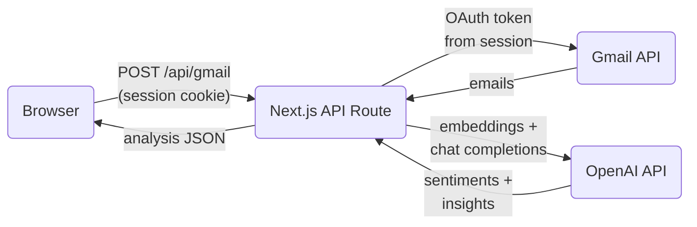
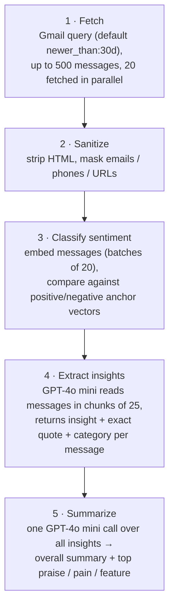

# Vibecheck

Vibecheck turns your inbox into a product feedback dashboard. It connects to Gmail, runs recent emails through a two-stage AI analysis, and shows you what people praise, what causes pain, and what they're asking for, with sentiment trends over the last 30 days.

<div align="center">
  <div style="display: flex; justify-content: center; gap: 10px;">
    
    
  </div>
</div>

## How It Works



Everything runs server-side in a single Next.js app (pages router). The browser never sees API keys or OAuth tokens. It authenticates with a NextAuth session cookie, and the server does the rest.

### The Analysis Pipeline

One `POST /api/gmail` request runs five stages ([pages/api/gmail.ts](pages/api/gmail.ts)):



**Stage 3: sentiment, without a model call per email.** On the first analysis, the server embeds two reference texts (typical positive and negative product feedback) as *anchor vectors*. Each email's embedding is compared to both anchors by cosine similarity; the difference between the positive and negative similarity scores maps to `positive` / `negative` / `mixed` / `neutral` via thresholds. This classifies hundreds of emails for fractions of a cent ([lib/openai.ts](lib/openai.ts)).

**Stage 4: insights with traceable quotes.** GPT-4o mini analyzes each message and must return an exact supporting quote and a category (`praise` / `pain` / `feature`) keyed by message index, which the server joins back to the message by Gmail message ID, so every card in the UI is traceable to a real email ([constants/prompts.ts](constants/prompts.ts)).

**Caching ([lib/cache.ts](lib/cache.ts)).** Embeddings and per-message insights are cached in memory, keyed by Gmail message ID (emails are immutable, so no invalidation) with a 24h TTL and a 5000-entry cap. A repeat run only pays for new messages plus the final summary call. Failed API calls are never cached.

**Failure behavior.** Individual failures degrade gracefully: a failed embedding batch falls back to neutral sentiment, a failed insight chunk is skipped. But *total* AI failure (bad key, no credits, outage) returns **502 "AI Analysis Unavailable"** rather than a fake all-neutral result, and the UI shows the error.

### Frontend

The dashboard ([pages/index.tsx](pages/index.tsx)) renders two views from one response:

- **Sentiment chart:** a stacked 30-day area chart (Recharts) computed client-side from per-message sentiments, with hover/click daily breakdowns
- **Feedback cards:** overall summary, top points, and three insight columns (praise / pain / feature requests), each with its quote, sender, and date

Light mode is the default; the toggle persists the user's choice in `localStorage`.

## Tech Stack

Next.js 15 (pages router) · React 19 · TypeScript · Tailwind CSS 3 · NextAuth (Google OAuth) · googleapis · OpenAI (`gpt-4o-mini`, `text-embedding-3-small`) · Recharts · Framer Motion · Zod

## Getting Started

### Prerequisites

1. **Google OAuth client** (Google Cloud Console → APIs & Services → Credentials, type "Web application"):
   - Enable the **Gmail API** on the project
   - Add redirect URI `http://localhost:3000/api/auth/callback/google`
   - If the consent screen is in Testing mode, add your Gmail address as a test user
2. **OpenAI API key** with credits (a full analysis run costs a few cents)

### Setup

```bash
npm install
cp .env.example .env.local   # then fill in the blanks
npm run dev                  # http://localhost:3000
```

Environment variables (validated at boot by [lib/env.ts](lib/env.ts); missing values fail fast with a named error):

| Variable | Purpose |
|---|---|
| `NEXTAUTH_URL` | App URL (`http://localhost:3000` in dev) |
| `NEXTAUTH_SECRET` | Session encryption; any long random string |
| `GOOGLE_ID` / `GOOGLE_SECRET` | OAuth client credentials |
| `GOOGLE_SCOPE` | `openid email profile https://www.googleapis.com/auth/gmail.readonly` |
| `OPENAI_API_KEY` | OpenAI key |
| `GMAIL_QUERY` *(optional)* | Which emails to analyze: any Gmail search query, e.g. `label:feedback newer_than:90d`. Defaults to `newer_than:30d`; set to `""` to fetch everything |

Then open the app, **Connect Gmail**, and click **Analyze**.

## Security & Operational Notes

- **Auth**: `/api/gmail` derives the Gmail token server-side from the NextAuth session (`getServerSession`); it never accepts tokens from the request body. Google refresh tokens keep sessions alive past the access token's expiry.
- **Rate limiting**: 10 requests/min per IP on `/api/gmail` in production (in-memory, skipped in dev); see [lib/rate-limit.ts](lib/rate-limit.ts).
- **Content hygiene**: email bodies are sanitized before analysis (HTML stripped; email addresses, phone numbers, and URLs masked); see [lib/gmail.ts](lib/gmail.ts).
- **Logging**: structured logs with sensitive-field scrubbing; per-model token usage and cost are logged in dev ([utils/logging.ts](utils/logging.ts), priced by [config/model-pricing.ts](config/model-pricing.ts)).
- **Security headers**: CSP, HSTS, X-Frame-Options etc. via [middleware.ts](middleware.ts).

## Deployment (Vercel)

1. Set all required env vars in the Vercel project (with `NEXTAUTH_URL` = production URL)
2. Add `https://<your-domain>/api/auth/callback/google` to the Google OAuth client's redirect URIs
3. CORS is self-configuring: the allowed origin resolves from `ALLOWED_ORIGINS` → `VERCEL_PROJECT_PRODUCTION_URL` → `VERCEL_URL` ([next.config.js](next.config.js))

**Caveat**: the cache and rate limiter are in-memory, so on serverless they are per-instance and reset on cold starts. Fine for personal use; swap in Redis/Vercel KV if hit rates matter at scale.

## Project Structure

```
pages/
  index.tsx               Dashboard UI
  api/gmail.ts            Analysis endpoint (auth → fetch → analyze)
  api/auth/[...nextauth]  Google OAuth + token refresh
lib/
  gmail.ts                Gmail fetch (query, parallel, sanitize)
  openai.ts               Embeddings, sentiment, insights, summary
  cache.ts                In-memory TTL caches (by message ID)
  rate-limit.ts           Per-IP rate limiting
  env.ts                  Env validation (zod)
components/               Chart, feedback cards, layout, primitives
constants/prompts.ts      System prompts + response schema
config/model-pricing.ts   Cost-per-token table
types/api.ts              Shared types (VibecheckResults, etc.)
```
