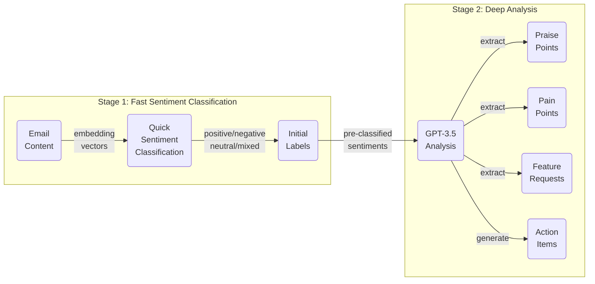
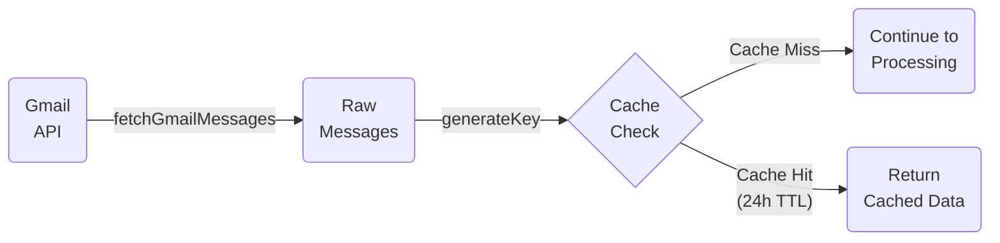
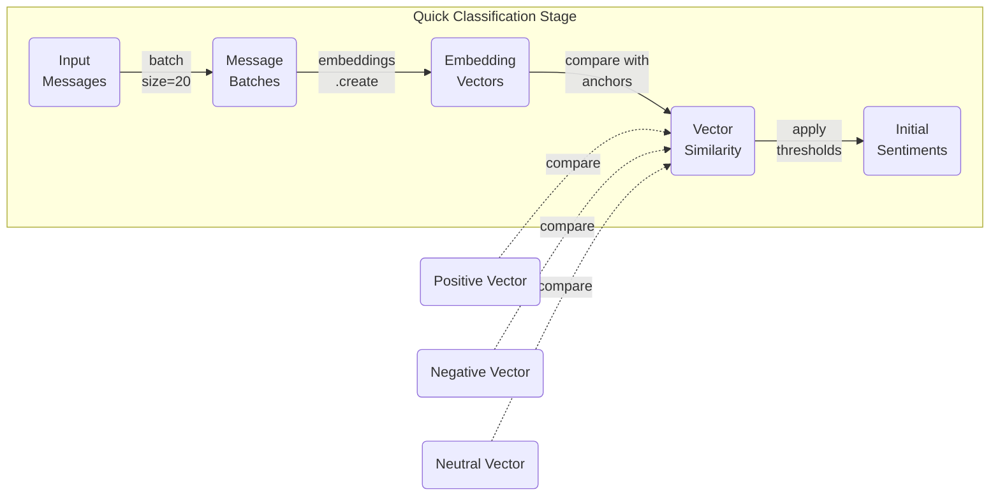
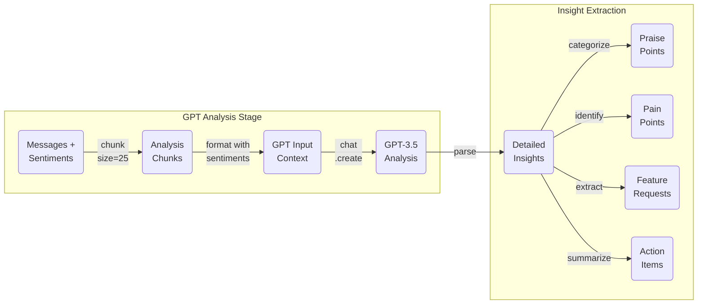
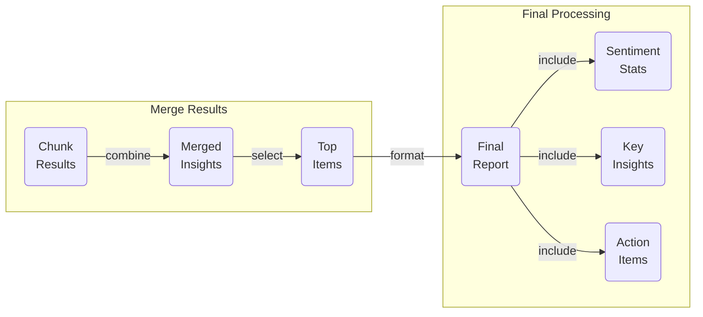
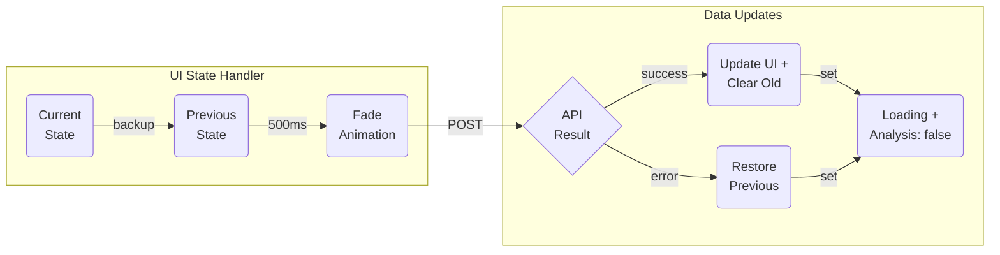

# Vibecheck

Vibecheck is an advanced feedback analysis system that processes and analyzes email feedback using AI to provide actionable insights and sentiment analysis.

## Core Features

### 1. Email Analysis Pipeline
- Fetches emails via Gmail API
- Processes content using AI models
- Extracts key insights

### 2. Sentiment Analysis
- Multi-model approach using OpenAI
- Real-time processing
- Detailed sentiment breakdown

### 3. Insight Generation
- Feature request tracking
- Common theme identification

## Data Flow & Processing Pipeline

### 1. High-Level System Overview

This overview diagram shows the two main processing stages of the system:
1. Fast classification using embedding vectors for quick sentiment analysis
2. Deep analysis using GPT for extracting detailed insights

The following sections detail each component of this pipeline.

### 2. Email Ingestion & Caching (`lib/gmail.ts`, `lib/cache.ts`)

### 3. Fast Sentiment Classification (`lib/openai.ts`)

### 4. Deep Insight Analysis (`lib/openai.ts`)

### 5. Result Aggregation (`lib/openai.ts`)

### 6. UI State Management (`pages/api/gmail.ts`)

