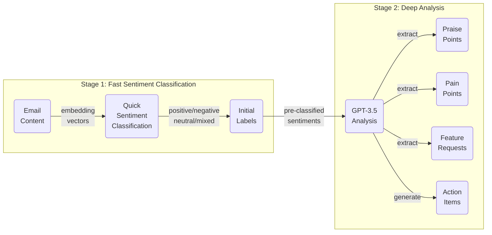
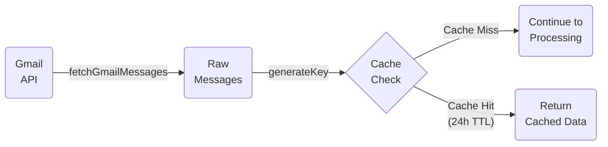
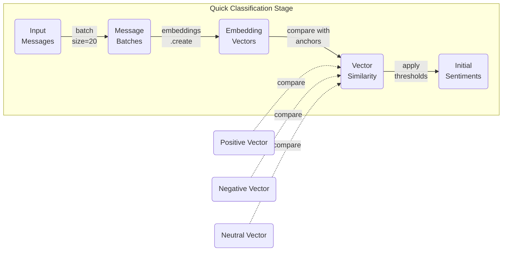
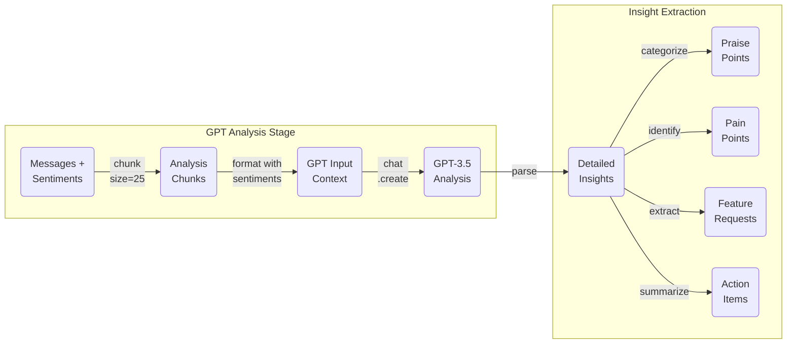
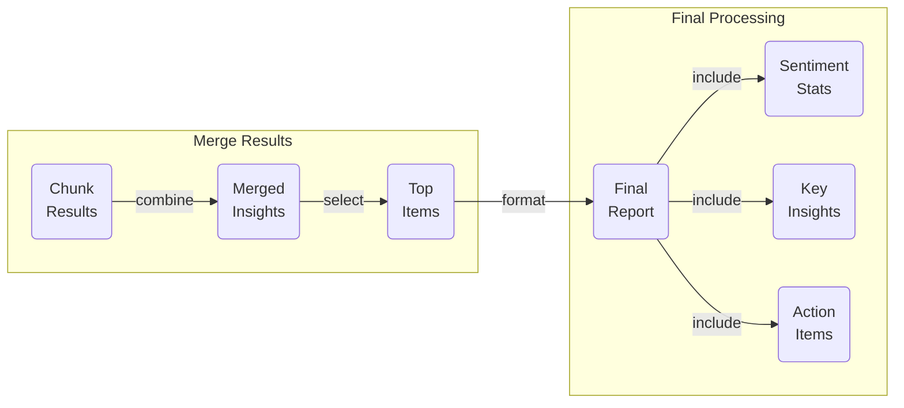
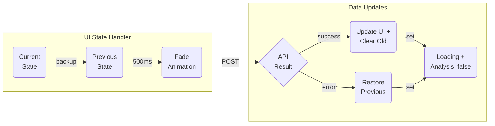

# Vibecheck

Vibecheck is an advanced feedback analysis system that processes and analyzes email feedback using AI to provide actionable insights and sentiment analysis.

## 🚀 Quick Start

```bash
# Clone the repository
git clone https://github.com/yourusername/vibecheck.git

# Install dependencies
npm install

# Set up environment variables
cp .env.example .env.local

# Start development server
npm run dev
```

## 📖 Project Overview

Vibecheck helps businesses understand customer feedback by:
- 📧 Processing feedback emails automatically
- 🎯 Providing sentiment analysis
- 📊 Generating actionable insights
- 📈 Tracking feature requests
- 📑 Creating comprehensive summaries

## 🏗️ Architecture

```
vibecheck/
├── app/              # Next.js 13+ app directory
├── components/       # React components
│   ├── common/      # Shared components
│   ├── features/    # Feature-specific components
│   └── layout/      # Layout components
├── lib/             # External service integrations
├── hooks/           # Custom React hooks
├── utils/           # Utility functions
├── types/           # TypeScript types
├── constants/       # Constants and enums
├── contexts/        # React contexts
├── styles/          # Global styles
└── __tests__/       # Test files
```

## 🔧 Technology Stack

- **Framework**: Next.js 13+
- **Language**: TypeScript
- **Styling**: Tailwind CSS
- **AI Integration**: OpenAI GPT-3.5
- **Authentication**: NextAuth.js
- **Email Processing**: Gmail API
- **Testing**: Jest & React Testing Library

## 🔄 Data Flow & Processing Pipeline

### 1. High-Level System Overview



This overview diagram shows the two main processing stages of the system:
1. Fast classification using embedding vectors for quick sentiment analysis
2. Deep analysis using GPT for extracting detailed insights

The following sections detail each component of this pipeline.

### 2. Email Ingestion & Caching (`lib/gmail.ts`, `lib/cache.ts`)



### 3. Fast Sentiment Classification (`lib/openai.ts`)



### 4. Deep Insight Analysis (`lib/openai.ts`)



### 5. Result Aggregation (`lib/openai.ts`)



### 6. UI State Management (`pages/api/gmail.ts`)



Each diagram represents a stage in our two-phase analysis pipeline:
- Phase 1: Fast sentiment classification using embeddings
  - Quick initial categorization
  - Vector-based similarity comparison
  - Immediate sentiment labels
  - Computationally efficient
  - Real-time capable

- Phase 2: Deep insight analysis using GPT
  - Uses pre-classified sentiments
  - Extracts specific feedback points
  - Identifies trends and patterns
  - Generates actionable insights
  - Provides detailed analysis

The pipeline combines speed and depth:
- Embeddings for fast, consistent sentiment labeling
- GPT for rich, contextual understanding
- Efficient resource usage
- Complementary analysis stages

## 🛠️ Core Features

### 1. Email Analysis Pipeline
- Fetches emails via Gmail API
- Processes content using AI models
- Generates sentiment scores
- Extracts key insights

### 2. Sentiment Analysis
- Multi-model approach using OpenAI
- Real-time processing
- Detailed sentiment breakdowns
- Trend analysis

### 3. Insight Generation
- Feature request tracking
- Common theme identification
- Priority categorization
- Action item generation

## 📚 Documentation

Each major directory contains its own detailed README:
- [Components Documentation](./components/README.md)
- [Hooks Documentation](./hooks/README.md)
- [Utils Documentation](./utils/README.md)
- [Types Documentation](./types/README.md)
- [Constants Documentation](./constants/README.md)
- [Library Documentation](./lib/README.md)
- [Testing Documentation](./__tests__/README.md)

## ⚙️ Configuration

### Environment Variables

```env
# Authentication
NEXTAUTH_URL=http://localhost:3000
NEXTAUTH_SECRET=your-secret

# Google API
GOOGLE_ID=your-google-client-id
GOOGLE_CLIENT_SECRET=your-google-client-secret
GOOGLE_SCOPE=https://www.googleapis.com/auth/gmail.readonly

# OpenAI
OPENAI_API_KEY=your-openai-api-key
```

## 🧪 Testing

```bash
# Run all tests
npm test

# Run with watch mode
npm test:watch

# Run E2E tests
npm test:e2e

# Generate coverage report
npm test:coverage
```

## 📝 Code Style

- Use TypeScript for type safety
- Follow ESLint configuration
- Use Prettier for formatting
- Follow component guidelines
- Write comprehensive tests

## 📦 Dependencies

Key dependencies and their purposes:
- `next`: React framework
- `react`: UI library
- `typescript`: Type safety
- `tailwindcss`: Styling
- `@openai/api`: AI integration
- `@types/*`: TypeScript definitions

## 🔐 Security

- All API keys stored in environment variables
- Authentication using NextAuth.js
- Rate limiting implemented
- Input validation on all endpoints
- Regular security audits

## 📈 Performance

- Optimized API calls
- Efficient data caching
- Lazy loading of components
- Image optimization
- Bundle size optimization

## 📱 Responsive Design

- Mobile-first approach
- Tailwind breakpoints
- Responsive components
- Touch-friendly interfaces

## 🔜 Roadmap

- [ ] Real-time analysis
- [ ] Enhanced visualization
- [ ] Additional AI models
- [ ] Automated responses
- [ ] Integration with more platforms

## 📄 License

This project is licensed under the MIT License - see the [LICENSE](LICENSE) file for details.

## 🤝 Support

For support, email support@vibecheck.com or join our Slack channel.
